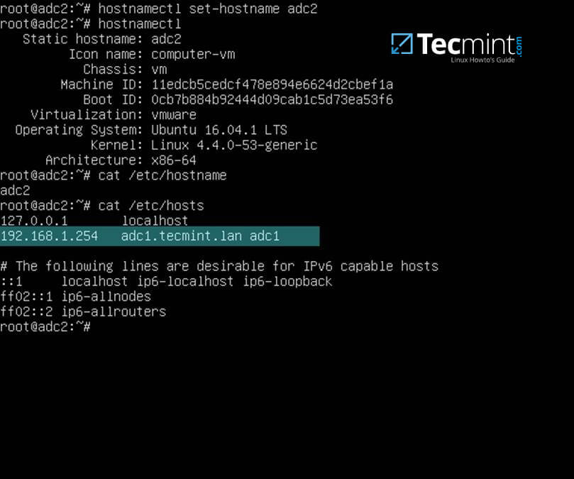
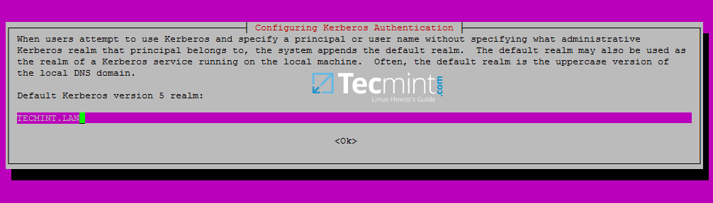
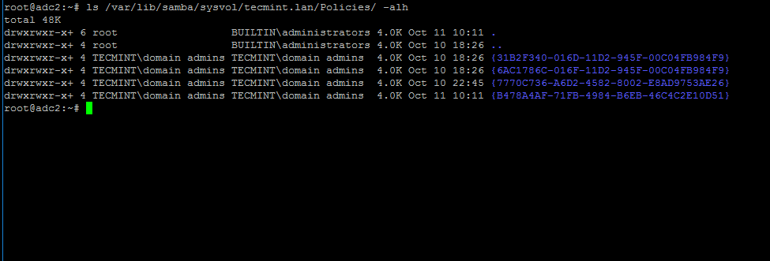
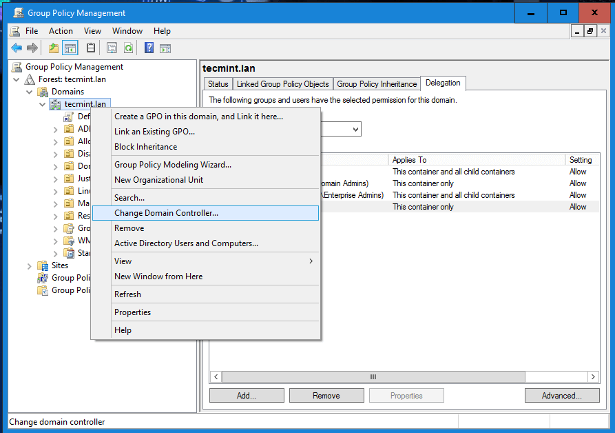
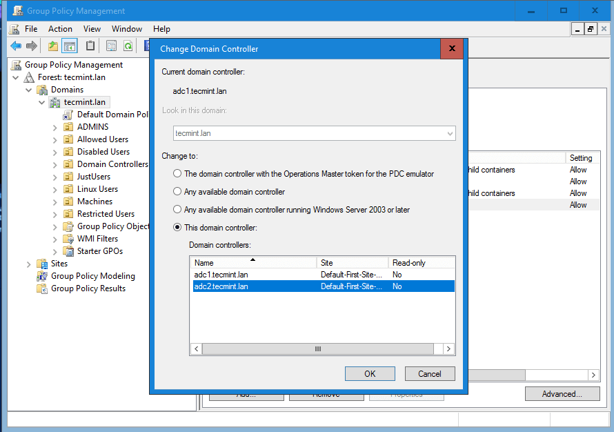

# FAIL OVER DOMAIN 
Ambil alih domain lama oleh domian baru, dengan anggapan domain lama mati total dan tidak boleh aktiv kembali dalam satu network

## ubah nama host
```
# hostnamectl set-hostname adc2
```
atau

```
# nano /etc/hostname

adc2

```

## Ubah Hosts file

```
IP_of_main_DC = ip domain server
FQDN_of_main_DC = nama lengkap host + domain
short_name_of_main_DC = nama host
```
edit 'hosts' file
```
# nano /etc/hosts
```
tambahkan 



## Setting Netplan
ubah ip dinamis netplant menjadi statis dan daftarkan dns nya

Script:
```
# nano /etc/netplan/00-installer-config.yaml

```
contooh 
```

root@nas5:/# cat /etc/netplan/00-installer-config.yaml 
# This is the network config written by 'subiquity'
network:
  ethernets:
    ens18:
      dhcp4: no
      addresses: [192.168.88.40/24]
      gateway4: 192.168.88.1
      nameservers:
                   search: [ptr.LOCAL]
                   addresses: [192.168.88.2]

  version: 2

```

## ping
```
# ping adc1

dan

# ping adc1.ptr.local
```
harus mendapat response

## install ntpdate 
```
# apt-get install ntpdate
```
singkronisasi jam dengan

```
# ntpdate 
```

<br>
<br>
<br>

# Step 2: Install Samba4 with Required Dependencies

## install program

````
# apt-get install samba krb5-user krb5-config winbind libpam-winbind libnss-winbind
````




di isi dengan nama dmoin 'PTR.LOCAL'

## kinit
```
# kinit domain-admin-user@YOUR_DOMAIN.TLD
# klist
```
<br>
<br>
<br>

# Step 3: Join to Samba4 AD DC as a Domain Controller

## stop service dan backup original configuration

backup samba 
```
# systemctl stop samba-ad-dc smbd nmbd winbind
# mv /etc/samba/smb.conf /etc/samba/smb.conf.initial
```
koin domin sebagai client dengan cara :
```
# samba-tool domain join your_domain DC -U "your_domain_admin"
```
atau
```
# samba-tool domain join tecmint.lan DC -U"tecmint_user"
```

-u yang digunakan haru sama format dnegan kinit sebelumnya "domain-admin-user@YOUR_DOMAIN.TLD"

contoh output
```
Finding a writeable DC for domain 'tecmint.lan'
Found DC adc1.tecmint.lan
Password for [WORKGROUP\tecmint_user]:
workgroup is TECMINT
realm is tecmint.lan
checking sAMAccountName
Deleted CN=ADC2,CN=Computers,DC=tecmint,DC=lan
Adding CN=ADC2,OU=Domain Controllers,DC=tecmint,DC=lan
Adding CN=ADC2,CN=Servers,CN=Default-First-Site-Name,CN=Sites,CN=Configuration,DC=tecmint,DC=lan
Adding CN=NTDS Settings,CN=ADC2,CN=Servers,CN=Default-First-Site-Name,CN=Sites,CN=Configuration,DC=tecmint,DC=lan
Adding SPNs to CN=ADC2,OU=Domain Controllers,DC=tecmint,DC=lan
Setting account password for ADC2$
Enabling account
Calling bare provision
Looking up IPv4 addresses
Looking up IPv6 addresses
No IPv6 address will be assigned
Setting up share.ldb
Setting up secrets.ldb
Setting up the registry
Setting up the privileges database
Setting up idmap db
Setting up SAM db
Setting up sam.ldb partitions and settings
Setting up sam.ldb rootDSE
Pre-loading the Samba 4 and AD schema
A Kerberos configuration suitable for Samba 4 has been generated at /var/lib/samba/private/krb5.conf
Provision OK for domain DN DC=tecmint,DC=lan
Starting replication
Schema-DN[CN=Schema,CN=Configuration,DC=tecmint,DC=lan] objects[402/1550] linked_values[0/0]
Schema-DN[CN=Schema,CN=Configuration,DC=tecmint,DC=lan] objects[804/1550] linked_values[0/0]
Schema-DN[CN=Schema,CN=Configuration,DC=tecmint,DC=lan] objects[1206/1550] linked_values[0/0]
Schema-DN[CN=Schema,CN=Configuration,DC=tecmint,DC=lan] objects[1550/1550] linked_values[0/0]
Analyze and apply schema objects
Partition[CN=Configuration,DC=tecmint,DC=lan] objects[402/1614] linked_values[0/0]
Partition[CN=Configuration,DC=tecmint,DC=lan] objects[804/1614] linked_values[0/0]
Partition[CN=Configuration,DC=tecmint,DC=lan] objects[1206/1614] linked_values[0/0]
Partition[CN=Configuration,DC=tecmint,DC=lan] objects[1608/1614] linked_values[0/0]
Partition[CN=Configuration,DC=tecmint,DC=lan] objects[1614/1614] linked_values[28/0]
Replicating critical objects from the base DN of the domain
Partition[DC=tecmint,DC=lan] objects[97/97] linked_values[24/0]
Partition[DC=tecmint,DC=lan] objects[380/283] linked_values[27/0]
Done with always replicated NC (base, config, schema)
Replicating DC=DomainDnsZones,DC=tecmint,DC=lan
Partition[DC=DomainDnsZones,DC=tecmint,DC=lan] objects[45/45] linked_values[0/0]
Replicating DC=ForestDnsZones,DC=tecmint,DC=lan
Partition[DC=ForestDnsZones,DC=tecmint,DC=lan] objects[18/18] linked_values[0/0]
Committing SAM database
Sending DsReplicaUpdateRefs for all the replicated partitions
Setting isSynchronized and dsServiceName
Setting up secrets database
Joined domain TECMINT (SID S-1-5-21-715537322-3397311598-55032968) as a DC
```

ceck output

```
# systemctl status samba-ad-dc
```

ubah smb.conf sama dengan 
```
# nano /etc/samba/smb.conf
```

restart samba ad dc dan lakukan replika
```
# systemctl restart samba-ad-dc
# samba-tool drs showrepl
```
backup krb5.conf, dan generate atau boleh disamakan dengan krb5.conf dari client domain yang lama
```
# mv /etc/krb5.conf /etc/krb5.conf.initial
# ln -s /var/lib/samba/private/krb5.conf /etc/
# cat /etc/krb5.conf
```
kinit dan klist ulang

```
# kinit administrator
# klist
```

# Step 4: Additional Domain Services Validations


cek ketersediaan domain, apakah kita bisa akses domain
```
# host your_domain.tld
# host -t SRV _kerberos._udp.your_domain.tld  # UDP Kerberos SRV record
# host -t SRV _ldap._tcp.your_domain.tld  # TCP LDAP SRV record

```


# Step 5: Enable Samba4 AD DC Service

disable winbind (berfungsi sebagai komunikasi domain atara sever dan client)
enable samba-ad-dc , agar otomatis jalan ketika os startup
```
# systemctl disable smbd nmbd winbind
# systemctl enable samba-ad-dc
```


# Step 6: Replicate Sysvol
jalankan untuk replikasi pertama
```
# rsync --dry-run -XAavz --chmod=775 --delete-after  --progress --stats  /var/lib/samba/sysvol/ root@adc2:/var/lib/samba/sysvol/

```
jalankan untuk replikasi keua

```
# rsync -XAavz --chmod=775 --delete-after  --progress --stats  /var/lib/samba/sysvol/ root@adc2:/var/lib/samba/sysvol/
```
cek hasil replikasi
```
# ls -alh /var/lib/samba/sysvol/your_domain/Policiers/

```
contoh hasil



cek dan repair bila ada error
```
# samba-tool ntacl sysvolcheck
```
repair
```
# samba-tool ntacl sysvolreset
```
dengan anggapan sudah fsmo dan domain pertama telah mati, boleh dikakukan hal dibawah ini




# Step 7: Transfering domain
```
# samba-tool fsmo show
InfrastructureMasterRole owner: CN=NTDS Settings,CN=DC1,CN=Servers,CN=Default-First-Site-Name,CN=Sites,CN=Configuration,DC=samdom,DC=example,DC=com
RidAllocationMasterRole owner: CN=NTDS Settings,CN=DC1,CN=Servers,CN=Default-First-Site-Name,CN=Sites,CN=Configuration,DC=samdom,DC=example,DC=com
PdcEmulationMasterRole owner: CN=NTDS Settings,CN=DC1,CN=Servers,CN=Default-First-Site-Name,CN=Sites,CN=Configuration,DC=samdom,DC=example,DC=com
DomainNamingMasterRole owner: CN=NTDS Settings,CN=DC1,CN=Servers,CN=Default-First-Site-Name,CN=Sites,CN=Configuration,DC=samdom,DC=example,DC=com
SchemaMasterRole owner: CN=NTDS Settings,CN=DC1,CN=Servers,CN=Default-First-Site-Name,CN=Sites,CN=Configuration,DC=samdom,DC=example,DC=com

```

dari serverdc baru 


```
seizing
samba-tool fsmo seize --role=domaindns -Uadministrador --force
```
hapus domain lama dengan anggapan domain server lama mati total
```
# samba-tool domain demote --remove-other-dead-server=DC2
```
usahakan sebelum fsmo transfer, dc lama harus mati

ganti dns atau cukup ganti ip lama menjadi ip yang sama dengan ip domain server yang lama

```
# samba-tool dns update localhost KOP.LOCAL KOP.LOCAL A <oldip> <newip>
# samba-tool dns update localhost KOP.LOCAL MAINDC A <oldip> <newip>
```

sebelum perpindahan ip cek dengan cara di ping, untuk mengetahui posisi ip saat ini

atau cukup dengan cara berikut 

Changing the IP Address of an AD DC in a Single-DC domain Environment
	Changing the IP address in a single-DC domain environment can cause problems with your Active Directory (AD). Verify that you have a restorable backup before changing the IP address. For details, see Back up and Restoring a Samba AD DC.
For example, to change the IP address of the domain controller (DC) from 10.99.0.1 to 10.88.0.1:

Disconnect or shut down clients connected to the AD DC.
Shut down the samba service.
Set the new IP address on the network interface and update the DNS server IP address in the /etc/resolv.conf and /etc/hosts files. For details, see your operating system's documentation.
If you use the BIND9_DLZ DNS back end:
If BIND is bound to the old IP address, update the listen-on parameter in the option{} section in the /etc/named.conf file:

```
# listen-on port 53 { 127.0.0.1;  10.99.0.1 10.88.0.1; };
```
Restart BIND.
Verify that BIND is listening on the new IP address:
```
# netstat -tulpn | grep ":53"
tcp        0      0 10.88.0.1:53       0.0.0.0:*          LISTEN      1109/named
tcp        0      0 127.0.0.1:53       0.0.0.0:*          LISTEN      1109/named
udp        0      0 10.88.0.1:53       0.0.0.0:*                      1109/named
udp        0      0 127.00.1:53        0.0.0.0:*                      1109/named
```
If you set the IP address in the interfaces parameter in the [global] section of your smb.conf file, update the address:
interfaces = 127.0.0.1 10.99.0.1 10.88.0.1
Start the samba service.
Update the DNS entries:

```
# samba_dnsupdate --verbose
```

## [source wiki.samba.org](https://wiki.samba.org/index.php/Changing_the_IP_Address_of_a_Samba_AD_DC)
## [source wiki.samba.org 2](https://wiki.samba.org/index.php/Transferring_and_Seizing_FSMO_Roles#Displaying_the_Current_FSMO_Role_Owners)
## [source tecmint.com](https://www.tecmint.com/join-additional-ubuntu-dc-to-samba4-ad-dc-failover-replication/)
## [source tecmint.com 2](https://www.tecmint.com/samba4-ad-dc-sysvol-replication/)
